# GymFlux — Sistema de Gestão para Academias (Henry 7x)

> **Substituto open-source moderno para o SCA** — controle de catracas **Henry 7x** + gestão completa de academia (alunos, planos, caixa e frequência). Roda na recepção em Windows, dev em Linux.


-lightgrey)


## O que é exatamente

**GymFlux** é um sistema desktop para academias que usam catraca **Henry 7x** (pedestal padrão). Ele é baseado no sistema SCA e entrega:

* **Cadastro de alunos** com CPF, foto, endereço, data nasc., telefone/e-mail, observações, **senha numérica de 4-8 dígitos visível** (PIN da catraca) e status (ativo/inativo/bloqueado). Inatividade automática: 90 dias sem entrada → inativa e limpa a senha.
* **Planos** (`DIARIO`, `MENSAL`, `TRIMESTRAL`, `SEMESTRAL`, `ANUAL`, `PERSONALIZADO`) com duração, valor (`Decimal`), tolerância de atraso e catálogo padrão (`PLANOS_PADRAO`).
* **Catraca Henry 7x** via `Henry.Kernel7x` COM 32-bit (serial `SComConfig` + `AdicionaCard`/`ListaPortasSeriais`, polling `ColetaEventos`). Em Linux roda 100% mockado (`MockHenry7x`).
* **Regras de acesso RB01–RB05**: tolerância de pagamento, vigência de matrícula, bloqueio manual, timeout de giro (7s) e anti-passback.
* **Caixa** por competência `YYYY-MM` (recebido/pendente/total), fechamento mensal com selo **FECHADO** e reabertura.
* **Funcionários** com entrada ilimitada (bypass RB01/RB02) + senha própria.
* **Frequência** (log do dia na catraca + aba global filtrável por aluno/mês/dia).
* **Configurações** persistidas em `data/gymflux_config.json` (direção SENHA/LIVRE, tolerância, timeout, porta) + **tema claro/escuro** com wallpaper configurável e **bandeja** (minimizar e continuar liberando em 2º plano).

Banco local **SQLite + SQLAlchemy 2.0 + Alembic** (`data/gymflux.db`, WAL, `GYMFLUX_*` env), pronto para Postgres futuro.

## Screenshots (tema escuro / claro)

| Catraca | Alunos |
|---|---|
| 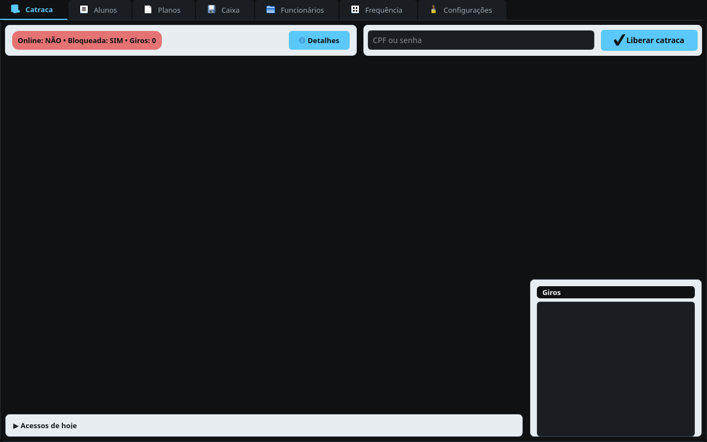 | 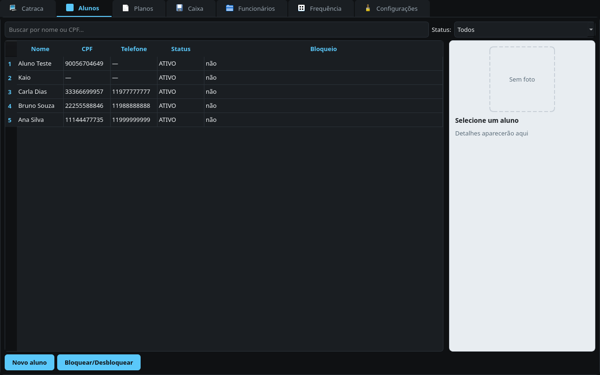 |
| 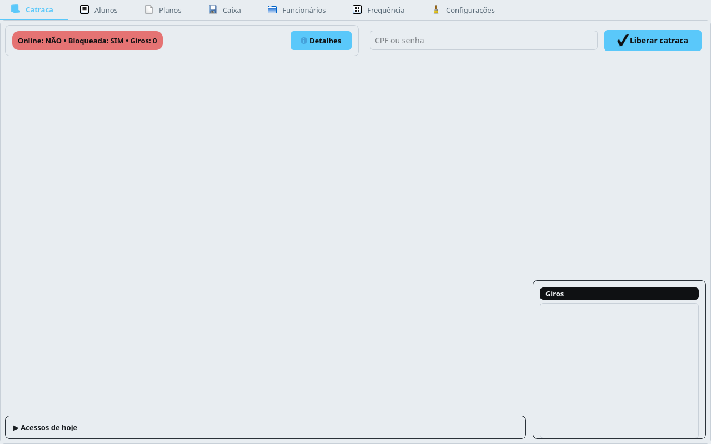 | 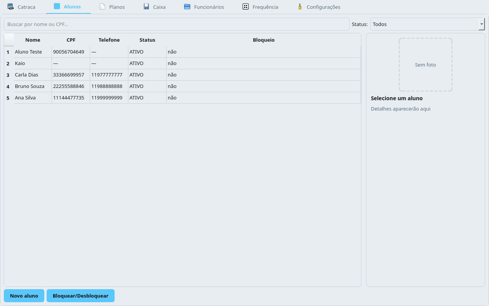 |

| Planos | Caixa |
|---|---|
| 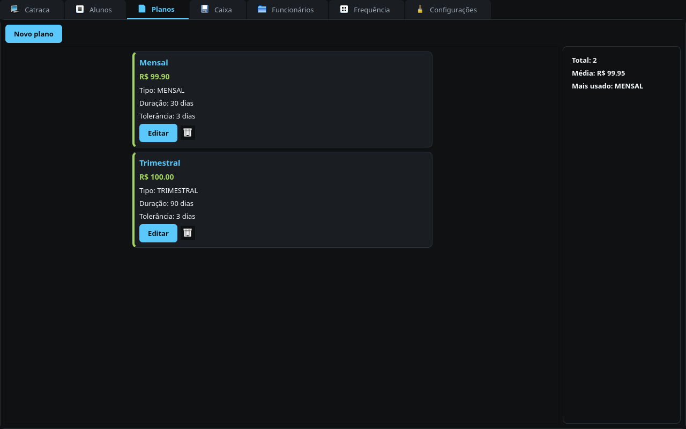 | 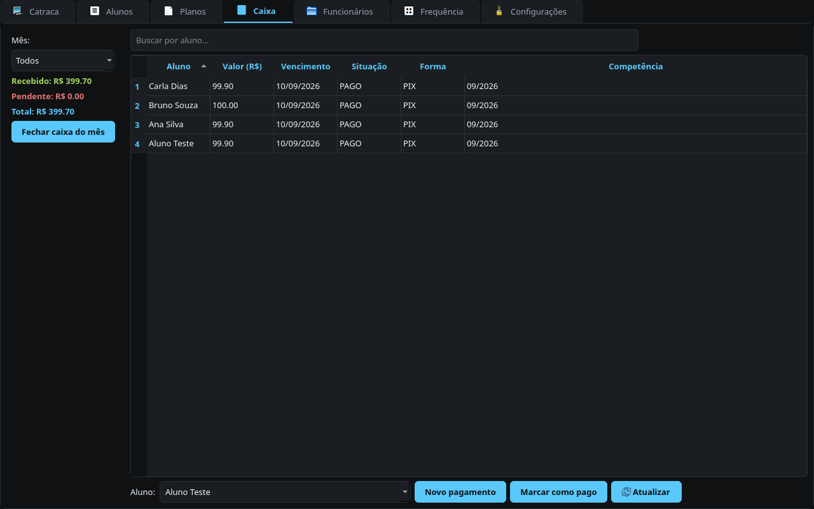 |
| 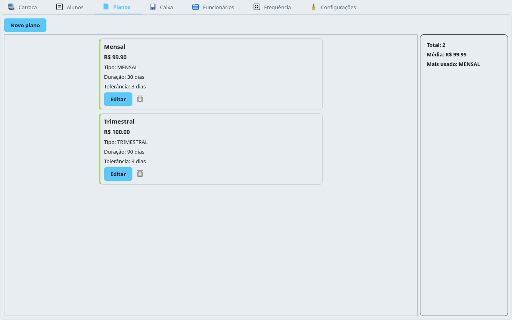 | 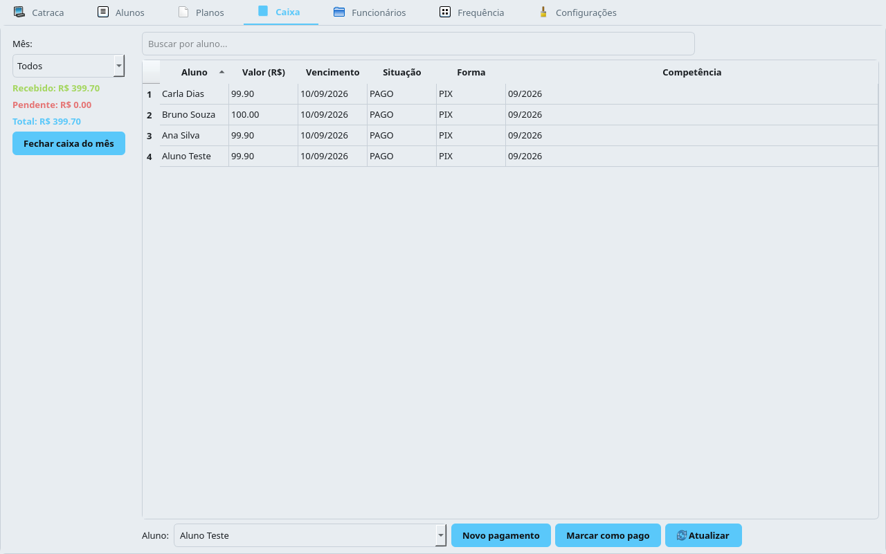 |

| Funcionários | Frequência | Configurações |
|---|---|---|
| 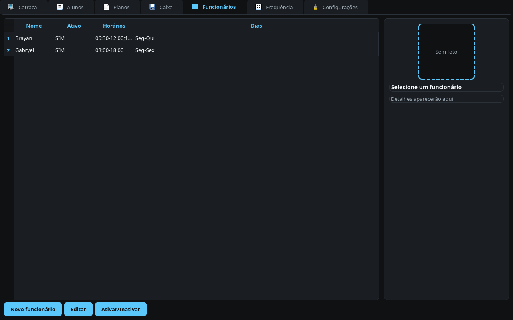 | 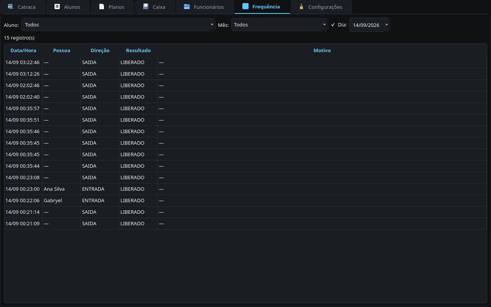 | 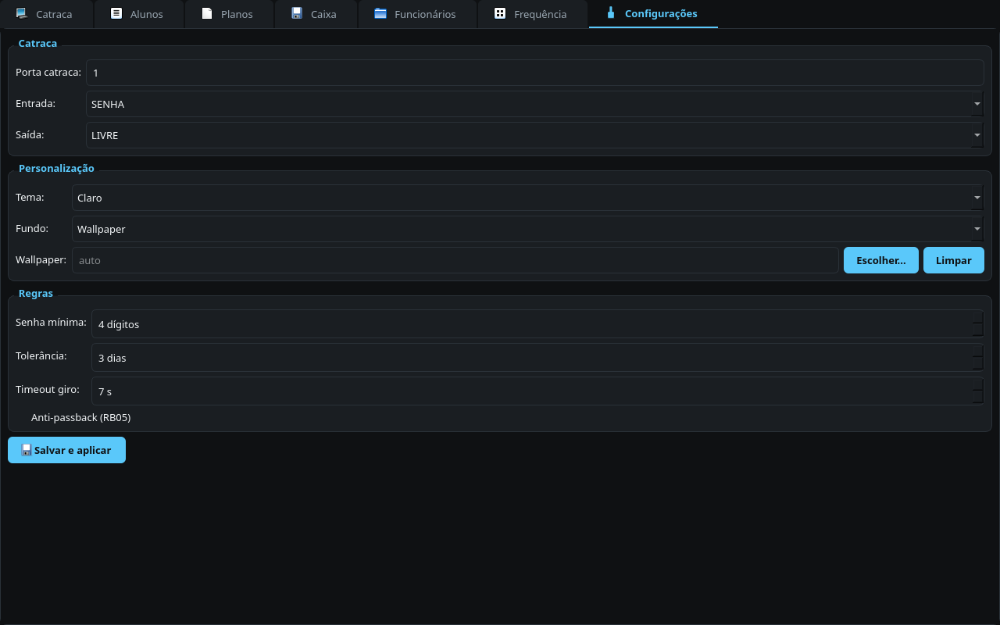 |
| 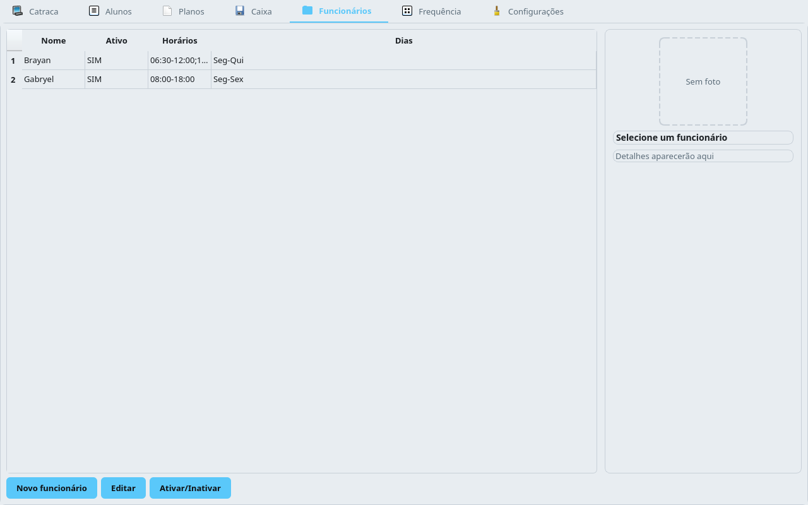 | 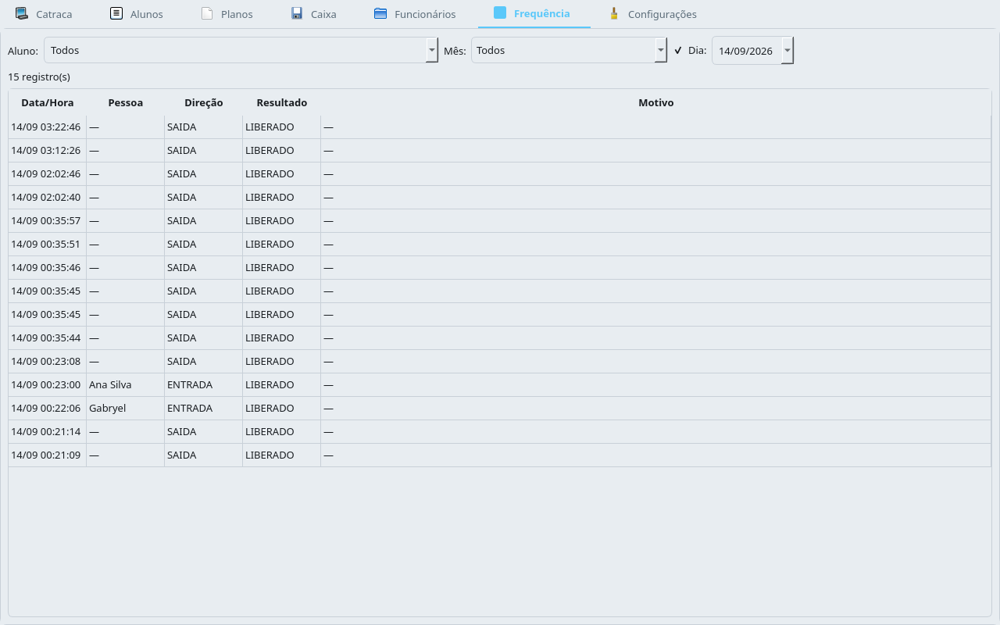 | 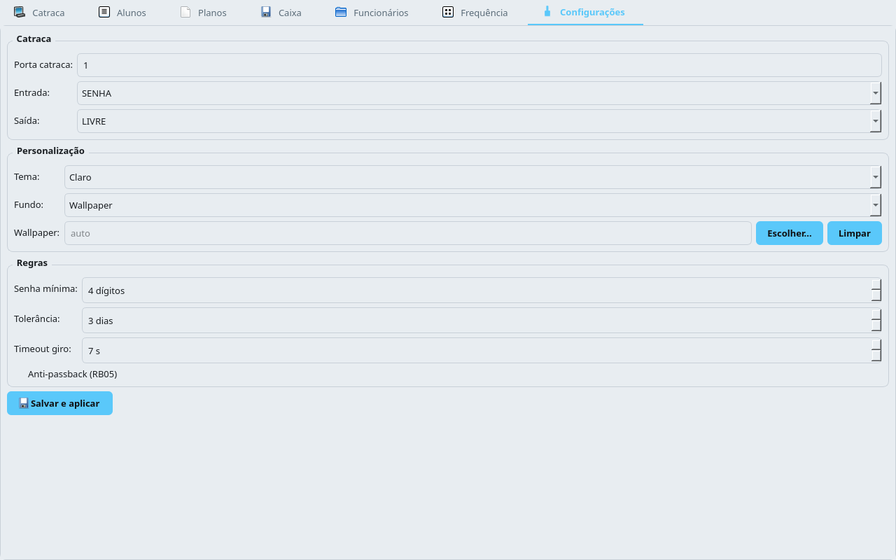 |

> Tema: azul `#5AC8FA`, preto `#0F1113`, lima `#A3D65C`, vermelho `#E57373`. Troca só a base no claro (`#E8EDF1`/`#C8D0D8` + ícone da aba selecionada em azul).

## Como funciona a catraca

```
[Teclado da catraca] --senha 4-8 dígitos--> IdentificarAcessoService
      → busca Aluno por senha (ou Funcionário) → RegraAcesso (RB01-RB05)
      → if LIBERADO: driver.liberar(Direcao) + pulso EnviaAcionaCtrl (relé 1=entrada, 2=saída)
      → bridge reemite giro via Signal → Dashboard mostra “Ana Silva — LIBERADO/NEGADO”
[Sem senha e direção=LIVRE]: libera direto (sem log de pessoa), com toast
```

* **Dev Linux:** `MockHenry7x` simula giro via `threading.Timer` / `simular_teclado`.
* **Prod Windows 32-bit:** `RealHenry7x` via `win32com.client.Dispatch("Henry.Kernel7x")` (serial, `SComConfig`).

## Quickstart (Linux dev)

```bash
# 1. Pré-requisitos: uv https://docs.astral.sh/uv/  + Python 3.11 (pinado em .python-version)
uv sync --group dev --extra ui

# 2. Testes / lint
uv run pytest -q            # 168 passed + 1 skipped
uv run ruff check src tests
uv run mypy src

# 3. Rodar UI (mock + SQLite)
uv run gymflux db upgrade && uv run gymflux db seed
uv run gymflux ui            # abre com 3 alunos demo (Ana/Bruno/Carla)

# 4. CLI útil
uv run gymflux mock-demo     # giro simulado
uv run gymflux info
uv run gymflux catraca status --porta COM3

# 5. Inspecionar DLL (quando disponível)
uv run python scripts/inspect_dll.py vendor/Henry/Henry7x/Kernel7x.dll
uv run python scripts/dump_henry_typelib.py > dumps/henry_typelib.txt  # só Windows 32-bit
```

## Quickstart (Windows prod)

```powershell
# DEVE ser Python 32-bit!
python -c "import struct; print(struct.calcsize('P')*8)"  # 32
# Registre a DLL uma vez como Admin:
C:\Windows\SysWOW64\regsvr32.exe vendor\Henry\Henry7x\Kernel7x.dll
# ou: vendor\Henry\Henry7x\HregSvr.exe  (como Admin)
uv sync --group dev --extra ui
$env:GYMFLUX_HENRY_MOCK="0"; $env:GYMFLUX_HENRY_PORTA="COM3"
uv run gymflux catraca status
```

## Build Windows (instalador — Fase 5)

> Gera `GymFlux.exe` (onefile windowed) + `GymFlux-Setup-vX.Y.Z.exe` via Inno Setup.
> `kernel7x.dll` **não** é bundlada (fica em `vendor/` gitignored); o app falha graciosamente sem DLL (`RuntimeError` em `real.py`).

**Pré-requisitos (Windows 10/11 64-bit, WOW64):**

- **Python 3.11 32-bit** (https://www.python.org/downloads/ — *Windows installer 32-bit*). Confirme `python -c "import struct; print(struct.calcsize('P')*8)"` → `32`.
- **uv** (https://docs.astral.sh/uv/) no `PATH`.
- **Inno Setup 6** (https://jrsoftware.org/isinfo.php) — adiciona `ISCC.exe`/`iscc` ao `PATH` (instalação padrão `C:\Program Files (x86)\Inno Setup 6\ISCC.exe`).

**Comando (PowerShell / pwsh — na raiz do repo):**

```powershell
pwsh scripts/build.ps1
# ou clássico:
scripts\build.bat
```

O script lê `version` de `pyproject.toml`, roda `uv sync --group dev --extra ui`, `uv run pyinstaller gymflux.spec --noconfirm` e, se o `iscc` estiver no `PATH`, compila o instalador `iscc installer/gymflux.iss /DMyAppVersion=x.y.z`.

**Saídas:**

- `dist\GymFlux.exe` — executável onefile windowed (sem console). Em modo frozen o DB e o JSON vão para `%APPDATA%\GymFlux\gymflux.db` e `gymflux_config.json` (`platformdirs`), com migrations/assets embarcados via `_MEIPASS`.
- `dist\installer\GymFlux-Setup-vX.Y.Z.exe` — instalador Inno Setup (`WizardStyle=modern`, `lzma2`, `ArchitecturesInstallIn64BitMode=x86compatible`). Instala em `{autopf}\GymFlux`, cria atalhos no Menu Iniciar/Área de Trabalho (checkbox) e opcionalmente em `Inicializar` (bandeja), com *Run postinstall*.

**Verificação rápida (sem catraca, sem DLL):**

```powershell
dist\GymFlux.exe --help
dist\GymFlux.exe catraca status   # erro gracioso se DLL ausente
dist\GymFlux.exe ui               # abre mock + SQLite, tray minimiza para bandeja
```

**CI:** `/.github/workflows/release.yml` faz o mesmo em `windows-latest` (Python 3.11 x86, `uv`, PyInstaller + Inno Setup Action) a cada tag `v*` e em `workflow_dispatch`, publicando o instalador como artifact/release.

## Estrutura

```
src/gymflux/              # pacote único v1
├── config/               # pydantic-settings (GYMFLUX_*)
├── core/                 # domínio puro: aluno, plano, pagamento, acesso, regras, caixa, funcionario
├── hardware/henry7x/     # interface.py (ABC) + mock.py + real.py (COM) + factory.py
│   └── biometric/        # mock (Fase 5: real Bio_*)
├── infra/                # db.py (Base), models/, repositories/, migrations/ (alembic)
├── services/             # liberar_acesso, identificar_acesso, cadastrar_aluno, registrar_pagamento, cobranca, inatividade
└── ui/                   # PySide6: app.py (tray+bandeja), theme.py, viewmodels/, views/ (7 abas), assets/
screenshots/              # prints das 7 abas × 2 temas (usados acima)
scripts/                  # inspect_dll.py, dump_henry_typelib.py
tests/                    # unit/ + integration/ (168 testes)
```

## Funcionalidades (roadmap)

- [x] **Fase 0:** Bootstrap + docs + mock
- [x] **Fase 1:** Domínio (RB01–RB05) + mock + 39 testes
- [x] **Fase 2:** SQLite + Alembic + repos + `gymflux db seed`
- [x] **Fase 3:** `RealHenry7x` COM serial + `gymflux catraca` (commissioning pendente `dump_henry_typelib.py` na VM)
- [x] **Fase 4:** UI PySide6 (7 abas), tema claro/escuro, wallpaper, bandeja, frequência, caixa, funcionários
- [ ] **Fase 5:** Biometria real (`Bio_*` / UFScanner) + instalador Inno Setup + assinatura

Ver `docs/ROADMAP.md` detalhado (docs é gitignored — veja `AGENTS.md` local).

## Contrato Henry 7x

Toda comunicação passa por `src/gymflux/hardware/henry7x/interface.py` (`Henry7xDriver`).

| Método | COM |
|---|---|
| `conectar(porta)` | `AdicionaCard(SComConfig, card)` / fallback `AdicionaCardSerial` |
| `liberar(direcao)` | `EnviaTipoCatraca(csgLibEntrada/csgLibSaida)` + `EnviaAcionaCtrl` relé |
| `on_giro` | polling `ColetaEventos` + `QuantRegsColetados` |
| `status()` | `Versao` / `ListaPortasSeriais` / `ThreadLastError` |

Veja `docs/DLL_CONTRACT.md` (100+ métodos do dump PowerShell).

## Licença

Apache-2.0 — ver `LICENSE`. Permissiva com grant de patentes (ver `docs/DECISIONS.md` ADR-004).

## Documentação (local, gitignored)

- [Arquitetura](docs/ARCHITECTURE.md) · [Requisitos](docs/REQUIREMENTS.md) · [Contrato DLL](docs/DLL_CONTRACT.md) · [Decisões ADRs](docs/DECISIONS.md) · [Roadmap](docs/ROADMAP.md) · [Memória do agente](AGENTS.md)

## Contribuindo

```bash
uv sync --group dev --extra ui
uv run ruff check src tests && uv run ruff format src tests
uv run mypy src
uv run pytest -q
```

Commits `conventional commits` (`feat:`, `fix:`, `chore:`), PT-BR ou EN.

## Aviso Legal

Este projeto **não** não é afiliado à Henry. O usuário deve possuir licença válida do hardware.
